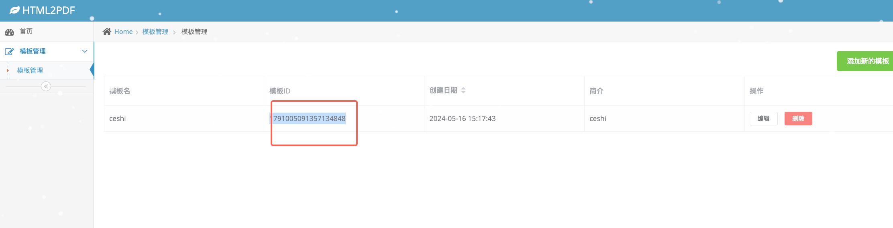
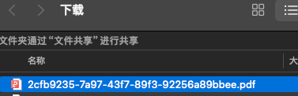

# html2pdf文档

## 一、how to use

### 1、run with docker 

```shell
docker run --name html2pdf -p 16666:16666 -v /Users/makabaka/html2pdf:/app/html2pdf -d liyibo888/html2pdf:v1
```

open browser http://localhost:16666/html2pdf 

add template



then send rest request to generate pdf

## rest api to generate a pdf

GET http://localhost:16666/html2pdf/generatePDFAndDownload

> Request Body 请求参数

```json
{
  "templateId": "string",
  "jsonData": "string"
}
```

### 请求参数

|名称|位置|类型|必选|说明|
|---|---|---|---|---|
|body|body|object| 否 |none|
|» templateId|body|string| 是 |none|
|» jsonData|body|string| 是 |none|

> Request Body Example

```json
{
  "templateId": "1791005091357134848",
  "jsonData": "{\"applyHospitalName\":\"市人民医院\"}"
}
```

### 返回结果

PDF file



### 2、run with local [有点难，不推荐]

#### 1.1 安装使用步骤概览


#### 1.2 详细安装教程（其实也非常简单，对于学过springboot的同学来说看1.1足够了）

待补充。。。。

##### 1.2.1 安装htmltopdf

这里我们以centos7为例
首先去htmltopdf官网(https://wkhtmltopdf.org/downloads.html) ,下载centos7版本的rmp包。

将下载的rmp包上传到服务器的/usr/local/html2pdf/source目录中，您也可以选择其他目录
```
[root@telemedicine-srv02 source]# ls
wkhtmltox-0.12.6-1.centos7.x86_64.rpm
[root@telemedicine-srv02 source]# pwd
/usr/local/html2pdf/source
```
进入到source目录执行命令 
```
rpm -ivh wkhtmltox-0.12.6-1.centos7.x86_64.rpm 
```
发现缺少一些依赖，直接使用yum安装即可

```
yum install xorg-x11-fonts-Type1
yum install xorg-x11-fonts-75dpi
```
之后再次执行安装命令即可安装成功
```
rpm -ivh wkhtmltox-0.12.6-1.centos7.x86_64.rpm 
```

查看安装位置

配置环境变量
以.bash_profile为例`vim ~/.bash_profile`
追加`PATH=$PATH:/usr/local/bin`
别忘了保存后`source ~/.bash_profile`
测试wkhtmltopdf的可用性，此处以百度首页为例
`wkhtmltopdf https://www.baidu.com ./baidu.pdf`


如果你打开这个图片大概率会看到中文是无法显示的，因为centos7里面没有相关的字体

解决方案：

复制windows计算机中C:\Windows\Fonts\simsun.ttc(宋体)，上传到服务器 /usr/share/fonts/chinese/TrueType/simsun.ttc

对于找不到simsun.ttc的同学，可以点击这里的链接直接下载：simsun.ttc快速下载链接：https://github.com/haust-lyb/html2pdf/files/6438836/SIMSUN.TTC.zip 下载后需要解压使用

再试试`wkhtmltopdf https://www.baidu.com ./baidu.pdf`发现成功显示了中文


到此wkhtmltopdf安装完毕


## 二、架构图

beetl模板渲染，wkhtml2pdf根据模板和数据的渲染结果生成pdf文件


## 三、扩展或更改

待补充

